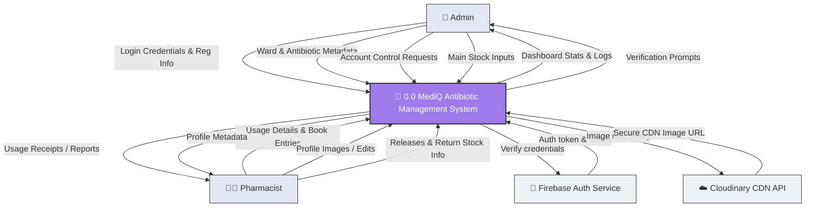
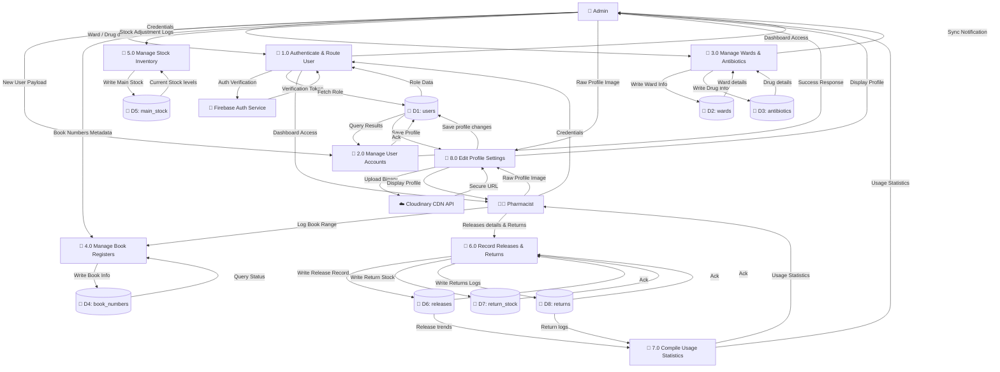

# MediQ Antibiotic Management App - Data Flow Diagrams (DFD) Report

This report outlines the **Data Flow Diagram (DFD) Level 0 (Context Diagram)** and **DFD Level 1 (Process Decomposition)** for the **MediQ Antibiotic Management System**, mapped exactly to the active Firestore collections and Firebase Authentication configurations.

---

## 1. DFD Level 0 (Context Diagram)

The Context Diagram defines the boundary of the **MediQ System**, showing the external entities that interact with it and the high-level inputs/outputs flowing to and from the system.

### External Entities:
1. **Admin**: The system administrator who manages accounts, hospital wards, antibiotic listings, main stock, and views reports.
2. **Pharmacist**: The pharmacist who logs book numbers, patient antibiotic releases, and return stock entries.
3. **Firebase Authentication Service**: An external provider that verifies security tokens and checks user credentials.
4. **Cloudinary Service**: An external CDN that processes and hosts user profile pictures.

---

## 2. DFD Level 1 (System Process Decomposition)

Level 1 breaks down the main system into specific processes, demonstrating how data flows between processes, external entities, and internal data repositories (Data Stores).

### Data Stores (Exact Firestore Collections):
* **D1: users** (`/users` collection) - User profiles, names, NIC, roles.
* **D2: wards** (`/wards` collection) - Registered hospital wards.
* **D3: antibiotics** (`/antibiotics` collection) - Registered antibiotic drugs details.
* **D4: book_numbers** (`/book_numbers` collection) - Tracking serial book numbers.
* **D5: main_stock** (`/main_stock` collection) - Master stock level logs.
* **D6: releases** (`/releases` collection) - Patient dosage release entries.
* **D7: return_stock** (`/return_stock` collection) - Returned inventory stock level tracking.
* **D8: returns** (`/returns` collection) - Logged returned item forms.

### Processes:
1. **1.0 Authenticate & Route User**: Handles sign-in, session status check, and redirects users to their appropriate dashboard wrappers based on roles.
2. **2.0 Manage User Accounts**: Admin-only controls for creating, updating, and disabling user profiles in the `users` store.
3. **3.0 Manage Wards & Antibiotics Inventory**: Admin controls for registering wards in `wards` and adding/editing listings in `antibiotics`.
4. **4.0 Manage Book Registers**: Validates and tracks serial book registers in the `book_numbers` store.
5. **5.0 Manage Stock Inventory**: Log details for master inventory adjustments in `main_stock`.
6. **6.0 Record Releases & Returns**: Pharmacist inputs patient releases to `releases` and processes returned stock logged in `returns` and `return_stock`.
7. **7.0 Compile Usage Statistics**: Collects data from the stores to generate charts, stock levels, and audit logs.
8. **8.0 Edit Profile Settings**: Users update profiles in `users` and upload pictures via the Cloudinary API.

